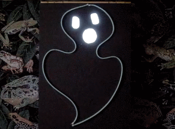

# casper

It is Halloween decoration project: image of ghost changing intensity of its 
elements brightness controlled by Attiny85 chip.  Ghost body is presented by 
two LED Flexible Silicone Neon-Like 1 Meter Ice Blue LED Strips. Face elements 
(eyes an mouth) showed by four white LED backlight large modules. All these
components can be found at https://www.adafruit.com/.

## Circut 

Project is powered by 12 V DC power supply (at least 2A output ). 12 V required 
to power up LED strips. Chip and backlight modules are powered by 5 V which is 
produced out of 12 V by step down power module based on LM2596.
Attiny85 controls backlight KED modules directly and silicone strips by 
NTE196 npn transistor (it is probably an overkill but it is only what I could buy
at local Fry's store. I think any npn transistor with output current > 1.6 A 
will fit). 
## Programming

Programming was done by Atmel Studio 7.0 in C language. 
Adam Dunkels protothread macros used as the core.
Fuze CKDIV8 was cleared so CPU frequency is 8 MHz. 

